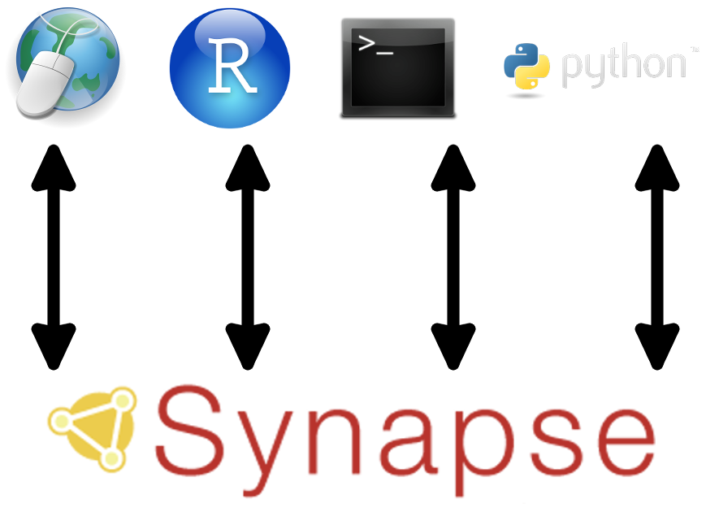
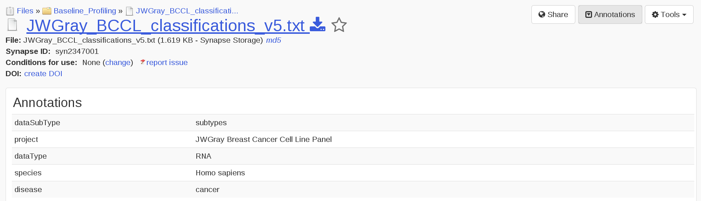
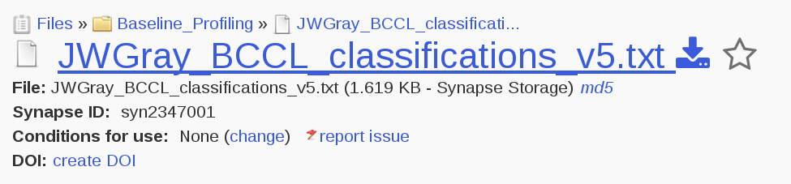
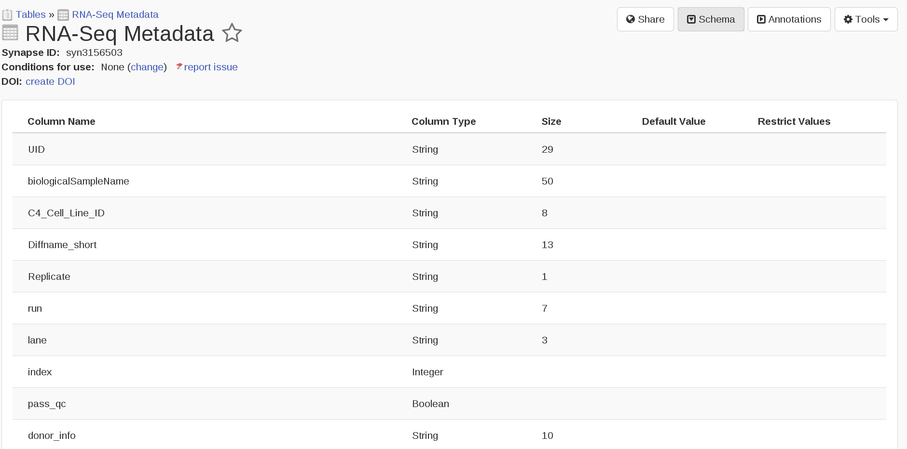
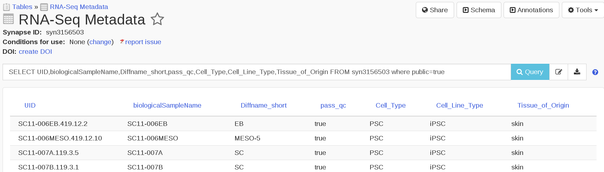
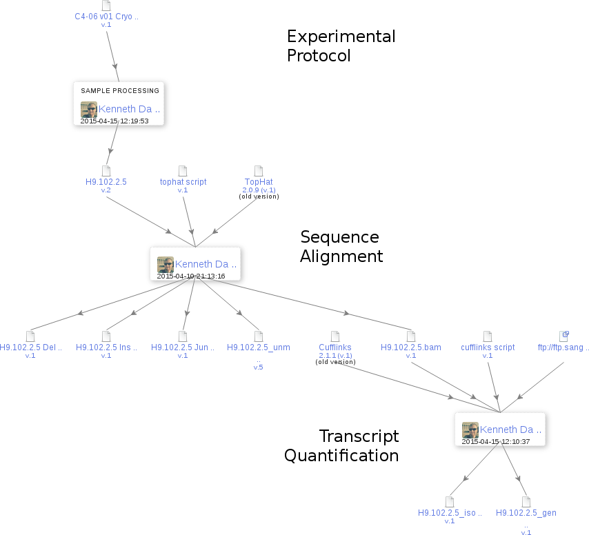

```{r loadlibs, echo=FALSE, warning=FALSE, message=FALSE, error=FALSE}
library(synapseClient)
library(knitr)
library(dplyr)

synapseLogin()

# control what is output when knitting
# These can be overridden in specific chunks
knitr::opts_chunk$set(
  echo=FALSE,
  warning=FALSE,
  message=FALSE,
  error = FALSE,
  tidy = FALSE)
```

## Concerns of large projects | Requires distributed storage: some things are local and others remote

<div class="centered">

</div>

## Synapse | A collection of living research projects

Enabling researchers to contribute to large-scale collaborative science across institutions

## Synapse

<div class="centered">

</div>

## Synapse | Enabling large-scale collaborative science

It is distributed:

* Agnostic to storage solution (cloud, local server, remote server)
* **New!** - your own Amazon S3 buckets

It is versioned:

* Keep track of changes and always get most recent

## Multiple ways to access Synapse

<div class="centered">

</div>

## Synapse | User-defined annotations

<div class="centered">

</div>

## Finding files | Annotations & Querying {.smaller}
```{r echo=TRUE, cache=TRUE}
q <- "select * from file where projectId=='syn2346643' and dataSubType=='cna'"
res <- synapseQuery(q)
```

```{r}
colnames(res) <- gsub(".*\\.", "", colnames(res))
res <- res[, c("name", "id", "dataType", "platform", "disease")]
kable(res)
```

[JWGray Breast Cancer Cell Line Panel (syn2346643)](https://www.synapse.org/#!Synapse:syn2346643/)

## Where the file is | Amazon S3 or ExaCloud

<div class="centered">

</div>

## Synapse | Structured data tables

<div class="centered">

</div>

## Synapse | Structured data tables { .smaller }

* Editable in the browser or programmatically
* Rows are versioned

```
SELECT UID,biologicalSampleName,Diffname_short,pass_qc,Cell_Type,Cell_Line_Type,Tissue_of_Origin 
FROM syn3156503 WHERE public=true
```

<div class="centered">

</div>


## Synapse | Documentation and description

* Wiki authoring for documentation and description

## Synapse | Access controls

* Fine-grained access controls (share whatever with whomever)

## Where a file comes from (provenance)

<div class="centered">

</div>

## Describing the file (or analysis) | Programmatic Wiki markup

Example using wiki using Rmd or IPyNB?

Take from somewhere else

## Automation | Uploading, Updating, Etc.

- programmatic clients (R, python, command line)

What we can automate (everything!):

- when files are added to exacloud and need to be added to Synapse
- previews of files
- annotation of files (where will this come from?)

## Example | Providing an overview of available data

Table displaying annotations on the files, link to a preview and how to download the file from Exacloud

## Synapse | Notes about security and Access Restrictions

Do we need this here?