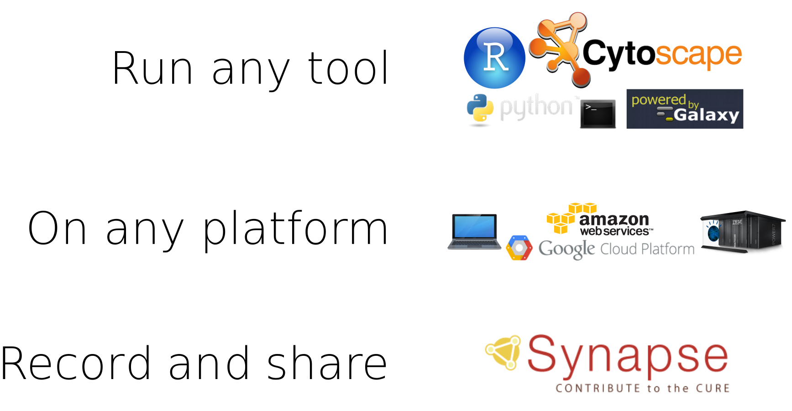
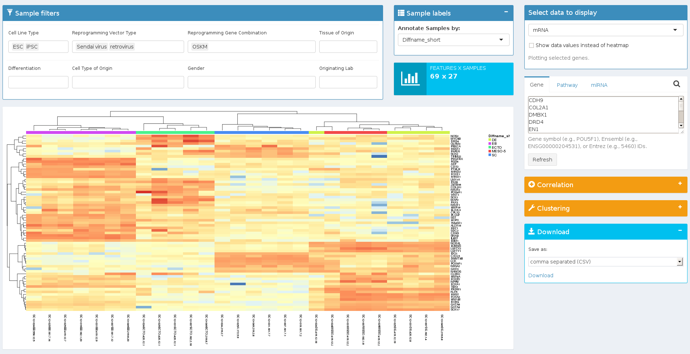

```{r loadlibs, echo=FALSE, warning=FALSE, message=FALSE, error=FALSE, eval=TRUE}
library(knitr)
library(dplyr)

library(synapseClient)
synapseLogin()

# control what is output when knitting
# These can be overridden in specific chunks
knitr::opts_chunk$set(
  echo=FALSE,
  warning=FALSE,
  message=FALSE,
  error = FALSE,
  tidy = FALSE)
```

```{r include=TRUE, eval=FALSE}
library(rGithubClient)
library(knit2synapse)

myFileName <- "index.Rmd"

thisScript <- getPermlink(getRepo("Sage-Bionetworks/20150518_LINCS"), 
                          myFileName)

thisFile <- File(thisScript, name=myFileName, parentId="syn4212390", synapseStore=FALSE)
thisFile <- synStore(thisFile)

knitfile2synapse(file = myFileName,
                 owner = thisFile@properties$id, 
                 wikiName = "Presentation at OHSU for MEP-LINCS.",
                 overwrite=T)

```

## Issues in large data-intensive projects | People working in parallel across the globe { .smaller }

<div class="centered">

</div>

<div class="notes">
Requires distributed storage: some things are local and others remote
</div>

---


<br/>

* A workspace that allows you to **aggregate**, **describe**, and **share** research
* A tool to improve **reproducibility** of data intensive science, recording progress as you work
* A set of living research projects enabling contribution to large-scale collaborative solutions

<div class="notes">
Enabling researchers to contribute to large-scale collaborative science across institutions
</div>

---

<div class="centered">

</div>

## Multiple ways to access | Synapse API

<div class="centered">

</div>

## Distributed, versioned file storage { .smaller }

<div class="centered">

</div>

<br/>

[http://dx.doi.org/10.7303/syn1773109](http://dx.doi.org/10.7303/syn1773109)

<div class="notes">
* Agnostic to storage solution (cloud, local server, remote server)
* **New!** - your own Amazon S3 buckets
</div>

## Getting data to Synapse { .smaller }

Use the web interface:

<div class="centered">

</div>

<br/>

or a simple command:

```
synapse store 
  --parentId syn3348585 \ # The Analysis folder in MEP-LINCS
  --annotations "{'analysisType': 'stats'}" \ # Some user-defined annotations
  myNewAnalysis.Rmd # The file to upload
```

## Getting data from Synapse

Use the web interface:

<div class="centered">

</div>

<br/>

or a simple command:

```
synapse get --id syn3247001
```


## Where the file is stored | Amazon S3, ExaCloud, Github, FTP, your laptop

<div class="centered">


</div>

<div class="notes">
Can work anyplace, store data just about anywhere!
Obv we aren't opening up access to your personal laptop, but for personal things it can work fine
</div>

## Annotations & querying { .smaller }

<div class="centered">

</div>

<br/>

* **Pro**: Completely user-driven
* **Con**: Completely user-driven
* Easily curate and search for specific files

[syn3156503](https://www.synapse.org/#!Synapse:syn3156503/)

## Annotations & querying { .smaller }

```{r echo=TRUE, cache=TRUE, eval=TRUE}
q <- "select * from file where projectId=='syn2346643' and dataSubType=='cna'"
res <- synapseQuery(q)
```

```{r printtbl, eval=TRUE}
colnames(res) <- gsub(".*\\.", "", colnames(res))
res <- res[, c("name", "id", "dataType", "platform", "disease")]
kable(res)
```

<br/>

[JWGray Breast Cancer Cell Line Panel (syn2346643)](https://www.synapse.org/#!Synapse:syn2346643/)

## Structured data tables

<div class="centered">

</div>

<br/>

[syn3156503](https://www.synapse.org/#!Synapse:syn3156503/)

<div class="notes">
We may want to have data that is queryable, but also enforce what data is entered - certain strings, a column of integers, etc
A relatively new feature in Synapse
</div>

## Structured data tables { .smaller }

```
SELECT UID,biologicalSampleName,Diffname_short,pass_qc,Cell_Type,Cell_Line_Type,Tissue_of_Origin 
FROM syn3156503 WHERE public=true
```

<div class="centered">

</div>

<br/>

[See the query](https://www.synapse.org/#!Synapse:syn3156503/tables/query/eyJsaW1pdCI6MjUsICJzcWwiOiJTRUxFQ1QgVUlELGJpb2xvZ2ljYWxTYW1wbGVOYW1lLERpZmZuYW1lX3Nob3J0LHBhc3NfcWMsQ2VsbF9UeXBlLENlbGxfTGluZV9UeXBlLFRpc3N1ZV9vZl9PcmlnaW4gRlJPTSBzeW4zMTU2NTAzIFdIRVJFIHB1YmxpYz10cnVlIiwgImlzQ29uc2lzdGVudCI6dHJ1ZSwgIm9mZnNldCI6MH0=)

## Structured data tables

* Rows are versioned
* Create/Update/Delete
* Editable in the browser or programmatically
* Use cases:
    - Tabular data files
    - Storing controlled vocabulary metadata
    - Curated file listings

<div class="notes">
Under the hood, we are always displaying the most recent version of each row
But it's possible to get any previous versions if necessary
</div>

## Documentation and description

<div class="centered">

</div>

<div class="notes">
Since the Synapse web site is probably most often used, we have flexible options for describing the data in a Project
</div>

## Documentation and description

<div class="centered">

</div>

## Wikis from RMarkdown and IPython | [Sage-Bionetworks/knit2synapse](https://github.com/Sage-Bionetworks/knit2synapse) { .smaller }

<div class="centered">

</div>

[syn2233188](https://www.synapse.org/#!Synapse:syn2233188/)

## Where a file comes from (provenance)

<div class="centered">

</div>

## Security and Access Restrictions

* Users and groups
* Fine-grained access controls at multiple levels
    - File
    - Folder
    - Project

## Synapse | Security and Access Restrictions

<div class="centered">

</div>

<div class="notes">
Sensitive data requires more control
</div>

## Automation | Uploading, Updating, etc.

- New files in ExaCloud $\rightarrow$ Synapse
- Annotation of files
- Provenance
- Available file listings
- Analysis code

<div class="notes">
Since Synapse is an API, this is easy - generally we provide customized solutions at different levels of automation
The important thing is to agree on a standard
</div>

## Building external tools

<div class="centered">

</div>

## Example projects | To draw inspiration

- [AMP AD Knowledge Portal](https://www.synapse.org/#!Synapse:syn2580853)
- [Progenitor Cell Biology Consortium](https://www.synapse.org/#!Synapse:syn1773109)
- [JWGray Breast Cancer Cell Line Panel](https://www.synapse.org/#!Synapse:syn2346643)
- [NCI Up For A Challenge](https://www.synapse.org/#!Synapse:syn3157598)

## Extensive documentation and examples

- [Synapse Tutorial](https://www.synapse.org/#!Help:GettingStarted)
- [Support Forums](http://support.sagebase.org/sagebase)
- [Interactive Guide (Mad Scientist Stu)](https://www.synapse.org/#!Help:Collaboratorium)
- [R](http://r-docs.synapse.org/) [client](https://www.synapse.org/#!Help:RClient)
- [Python](http://python-docs.synapse.org/) [client](https://www.synapse.org/#!Help:PythonClient)
- [Command line](http://python-docs.synapse.org/CommandLineClient.html) [client](https://www.synapse.org/#!Help:CommandLineClient)
- [github:Sage-Bionetworks/synapseTutorials](https://github.com/Sage-Bionetworks/synapseTutorials)
- [kenneth.daily@sagebase.org](mailto:kenneth.daily@sagebase.org)

## Thank you! | Questions?

* [MEP-LINCS](http://www.lincsproject.org/centers/data-and-signature-generating-centers/oregon-u/) Group
* [Sage Bionetworks](http://sagebase.org/)
