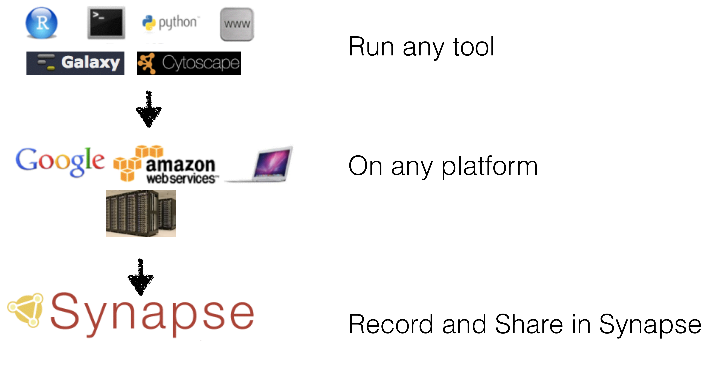

## Concerns of large projects | Requires distributed storage: some things are local and others remote

## Synapse | A collection of living research projects

Enabling researchers to contribute to large-scale collaborative science across institutions

## Synapse

## Synapse | Enabling large-scale collaborative science

* distributed & versioned file system
* rich annotations (metadata) 
* agnostic to storage solution (cloud, local server, etc.)
* Strongly typed customizable schemas for structured data 
* data accessed via any number of ‘clients’ 
    - [www.synapse.org](https://www.synapse.org/)
    - programmatic clients (R, python, command line)
* wiki authoring 

access controls (share whatever with whomever)

## Finding files | Annotations & Querying

Show ex query using existing breast cancer proj [syn2346643](https://www.synapse.org/#!Synapse:syn2346643/)

## Where the file is | Amazon S3 or ExaCloud

Show how Synapse file will link back to original - how to download

## Where a file comes from | Provenance

Image(s) that illustrate connection b/t data and analyses

## Describing the file (or analysis) | Programmatic Wiki markup

Example using wiki using Rmd or IPyNB?

Take from somewhere else

## Automation | Uploading, Updating, Etc.

- programmatic clients (R, python, command line)

What we can automate (everything!):

- when files are added to exacloud and need to be added to Synapse
- previews of files
- annotation of files (where will this come from?)

## Example | Providing an overview of available data

Table displaying annotations on the files, link to a preview and how to download the file from Exacloud

## Synapse | Notes about security and Access Restrictions

Do we need this here?